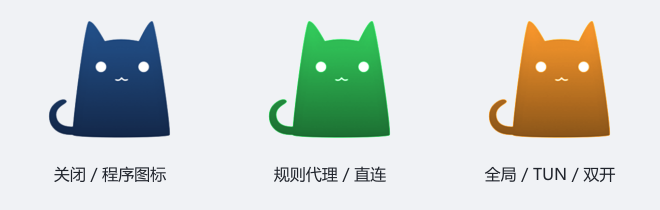

# Clash Party：经典 CFW 小猫版

基于 [Clash Party v2.0.3](https://github.com/mihomo-party-org/clash-party/tree/v2.0.3) 的个人定制版本。



| 状态                                 | 图标       |
| ------------------------------------ | ---------- |
| 程序、桌面快捷方式、任务栏、代理关闭 | 原版深蓝色 |
| 规则代理、直连，仅系统代理开启       | 绿色       |
| 全局代理、TUN、系统代理与 TUN 双开   | 橙色       |

图标全部使用透明背景，保留原版小猫的光感、渐变、轮廓和白色五官。界面左上角为 32×32 像素，程序及托盘图标裁掉多余留白，并提供多种 ICO 尺寸。TUN 的橙色优先于规则和直连模式。关闭状态按系统代理与 TUN 开关判断，不代表节点连通性。

## 在另一台电脑上使用

打开本仓库的 [Releases](https://github.com/faneikuangtu12138/clash-party-cfw-icons/releases/latest)，下载 Windows x64 的 `setup.exe` 安装包或 `portable.7z` 便携包。便携包解压后运行 `Clash Party.exe`，用户数据保存在同目录的 `data` 中。图标和配色已编入程序，无需另外修改 EXE 或 app.asar。

仓库保存的是图标和软件默认行为。个人订阅、节点、密码和代理配置仍由用户自行导入；软件内可用原有导出、导入或备份功能迁移。

## 从源码构建

需要 Git、Node.js 22+ 和 package.json 指定版本的 pnpm，在 Windows PowerShell 中执行：

```powershell
git clone https://github.com/faneikuangtu12138/clash-party-cfw-icons.git
cd clash-party-cfw-icons
pnpm install --frozen-lockfile
pnpm run review
pnpm test
pnpm build:win --x64
node scripts/cfw-release.mjs
```

安装与构建过程中会从上游下载 Electron、Mihomo 内核、Geo 数据、Sub-Store 和 Windows 辅助工具。安装包和便携包生成在 `dist` 中，附带 SHA-256 校验文件。

## 自动构建与更新

推送 `v*-cfw.*` 标签会通过 GitHub Actions 校验代码、构建 Windows x64 安装包与便携包，并发布 Release。也可以在 Actions 页面手动运行 Windows CFW build 流程；手动构建提供构建产物下载。

本定制版的软件更新源指向本仓库，避免更新回官方版本后丢失图标。未来更新时，先合并上游源码，保留本版图标及状态映射，再修改 package.json 的版本并发布新标签。

## 来源

保留 Clash Party 的 GPL-3.0 许可证及上游版权说明。原始 CFW 小猫图片来自 [lantongxue/clash_for_windows_pkg](https://github.com/lantongxue/clash_for_windows_pkg/blob/main/clash_for_windows/opt/clash_for_windows/icon_256.png)。本次颜色变体通过 SVG 色彩矩阵保留原图的明暗层次，SVG 源文件位于 `images/classic-cfw-*.svg`。
